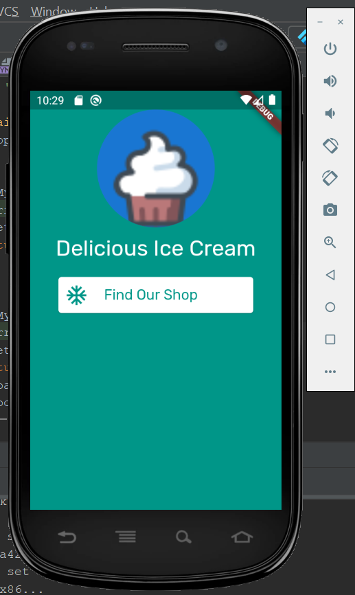

This is a very basic Android Studio app that uses Dart. To run this app, you'll need to install Android Studio, the Flutter SDK,
an Android/IPhone emulator... so rather than asking the TA to do that, we will just show off our app in the video :). Our Tic Tac Toe program
is much easier to run. 

